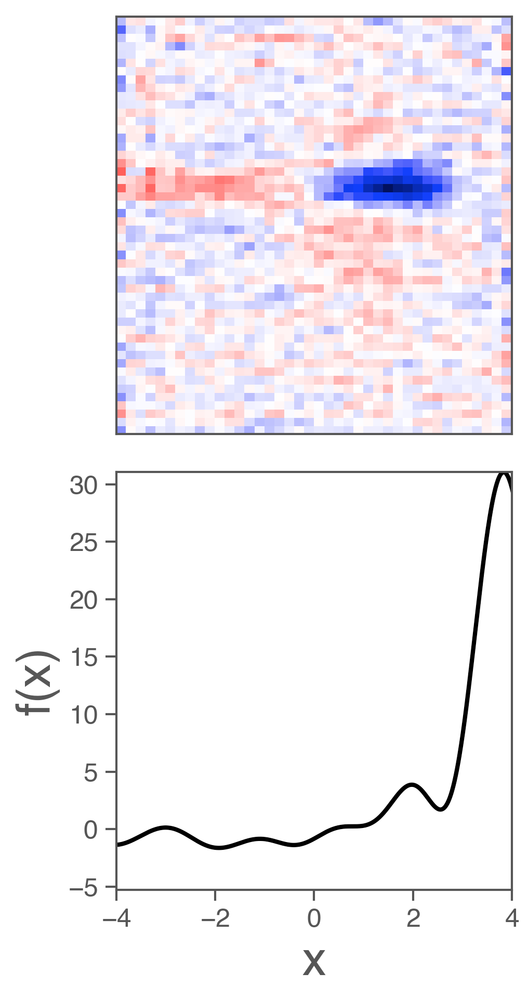

## Retinal data used in "Inferring hidden structure in multilayered neural circuits"

This repository contains data used in the paper [Inferring hidden data in multilayered neural circuits](https://www.biorxiv.org/content/early/2018/06/14/120956).

The data consists of the responses of 23 salamander retinal ganglion cells in response to 40 minutes of a spatiotemporal white noise stimulus.

These data were used to fit linear-nonlinear (LN) and multilayered linear-nonlinear (LN-LN) models to retinal data.
The example scripts provided show how to fit these models on this data using the open source [nems](https://github.com/ganguli-lab/nems) package.

### Demo

To run the demo, first install the [nems](https://github.com/ganguli-lab/nems) package (and its dependencies).
You also need to install numpy and the [h5py](http://docs.h5py.org/en/latest/index.html) package to load the data.

The demo can be run using:
```python demo.py```

This will fit both an LN model and an LN-LN model to the same cell, without any regularization, and plot the learned model parameters for each.
The `nems` package contains more information on how to save and test models and add regularization.

Example LN model parameters (linear filter and nonlinearity) that result from running the demo:



### Citation

If you use the data in this repo, please cite our paper (https://journals.plos.org/ploscompbiol/article?id=10.1371/journal.pcbi.1006291)
```
@article{maheswaranathan2018inferring,
  title={Inferring hidden structure in multilayered neural circuits},
  author={Maheswaranathan, Niru and Kastner, David B and Baccus, Stephen A and Ganguli, Surya},
  journal={PLoS computational biology},
  volume={14},
  number={8},
  pages={e1006291},
  year={2018},
  publisher={Public Library of Science}
}
```
